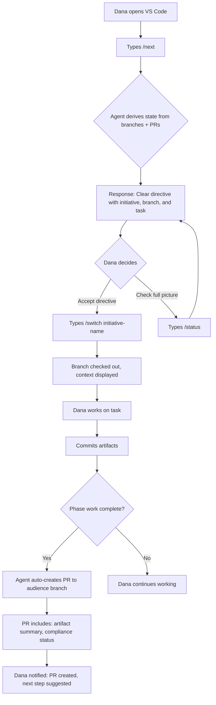
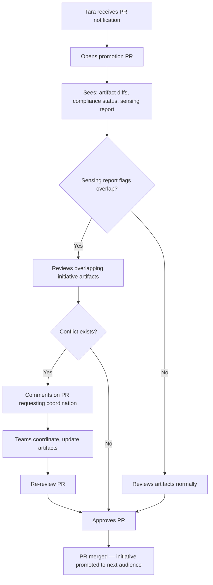
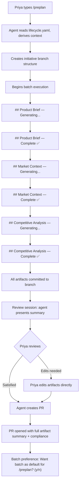
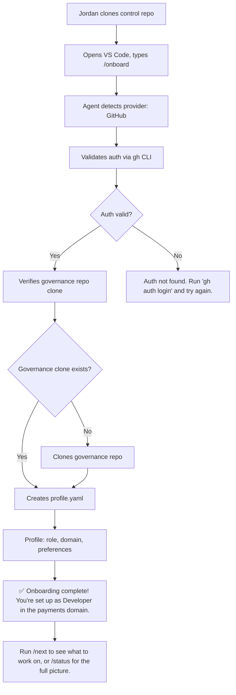
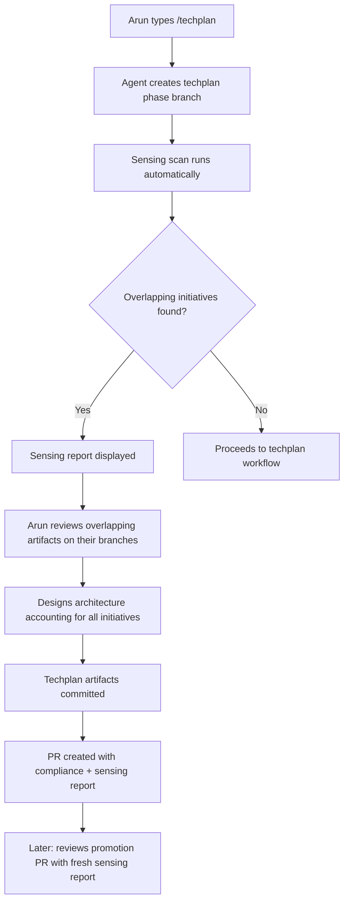

# UX Design Specification bmad.lens.bmad

**Author:** CrisWeber
**Date:** 2026-03-08

---

## Executive Summary

### Project Vision

lens-work v2 is a conversational lifecycle orchestration agent (`@lens`) that lives inside VS Code Copilot chat. Users type slash commands — `/preplan`, `/status`, `/switch`, `/promote` — and the agent routes them through structured workflows that manage git branches, produce planning artifacts, enforce constitutional governance, and surface cross-initiative conflicts automatically.

This is not a visual application. There are no screens, no buttons, no forms. The entire user experience happens through a chat panel in the IDE. The "interface" is the conversation itself: the commands users type, the responses the agent gives, the artifacts it produces, and the git operations it performs silently behind the scenes.

The UX challenge is making a complex multi-domain lifecycle system feel as simple as talking to a knowledgeable colleague who never forgets context, always knows what to do next, and handles all the git mechanics so users can focus on their actual work.

### Target Users

Six distinct personas interact with `@lens` at different frequency and depth:

| Persona | Primary Commands | Frequency | Complexity |
|---------|-----------------|-----------|------------|
| **Dana (Developer)** | `/next`, `/switch`, `/dev` | Daily | Low — just needs direction and branch context |
| **Tara (Tech Lead)** | PR review, `/techplan` | Several times per sprint | Medium — reviews sensing reports, constitution compliance |
| **Arun (Architect)** | `/techplan`, sensing reports | Per-initiative | High — cross-initiative architecture coordination |
| **Priya (Product Owner)** | `/preplan`, `/businessplan` | Per-initiative | Medium — batch artifact creation, PR review |
| **Sam (Scrum Master)** | `/status`, `/sprintplan` | Daily | Low-medium — consolidated reporting |
| **Alex (Admin)** | `/onboard`, module updates | Infrequent | Low — self-service setup |

### Key Design Challenges

1. **Single interface, six mental models** — all personas use the same chat panel, but their expectations, vocabulary, and workflow depth differ radically. Dana wants a quick answer; Priya wants a complete artifact set.
2. **Invisible state management** — git branch topology is the state machine, but users should never need to think about branches. The abstraction must be complete enough that users think in terms of "initiatives" and "phases," not "branches" and "PRs."
3. **Trust through transparency** — when the agent creates branches, commits artifacts, or opens PRs on behalf of the user, it must communicate what it did clearly and concisely. Users must trust the agent without needing to verify every git operation.
4. **Information density in a chat interface** — `/status` needs to convey multi-initiative state in a scannable format within a chat message. Too much detail overwhelms; too little is useless.
5. **Batch mode coherence** — workflows that produce complete artifacts in one pass must feel structured, not like an uncontrolled wall of text. Progress indicators, section headers, and clear completion signals are essential.

### Design Opportunities

1. **Command predictability** — the same command surface as v1 means zero learning curve for existing users. New users learn ~11 commands total. This is a UX strength to preserve.
2. **Context-aware responses** — the agent always knows which initiative, phase, and audience the user is in. Every response can be contextually relevant without the user providing redundant information.
3. **Proactive guidance** — `/next` is the killer UX feature. Instead of users figuring out what to do, the system tells them. This inverts the typical developer tool experience.
4. **Automatic sensing reports** — surfacing cross-initiative conflicts without users asking is the kind of "magic moment" that builds deep trust in the system.

---

## Core User Experience

### Defining Experience

**"Type a command, get things done."**

The defining experience of lens-work v2 is typing a single slash command and having the right thing happen — the right branch checked out, the right workflow started, the right artifacts produced, the right PR created. The user's mental model is simple: "I tell `@lens` what phase I'm working on, and it handles everything else."

The core loop for every persona is:

```
/command → agent responds with context → work happens → artifacts committed → PR created → governance checked
```

The user never needs to:
- Know which branch they should be on
- Manually create or name branches
- Remember the lifecycle phase sequence
- Manually create PRs or write PR descriptions
- Run constitution compliance checks
- Search for overlapping initiatives

All of this is handled by the agent, transparently.

### Platform Strategy

**Primary Platform:** VS Code IDE with GitHub Copilot Chat extension

**Interaction Mode:** Conversational chat — text input, structured text output

**Platform Constraints:**
- Chat panel width is fixed and narrow (~400-600px)
- Output is rendered as Markdown (headings, tables, code blocks, lists)
- No custom UI widgets — all feedback through text and Markdown formatting
- Context window limits mean the agent must be disciplined about what it loads
- No persistent visual indicators — each response stands alone

**Platform Opportunities:**
- Markdown rendering supports tables, code blocks, and formatted output
- Chat history provides a natural audit trail
- Users are already in their IDE — zero context switching
- File creation and editing happen in the same workspace
- Terminal access is available for git operations

### Effortless Interactions

The following interactions must feel completely automatic:

| Interaction | What the User Does | What Happens Behind the Scenes |
|-------------|--------------------|-------------------------------|
| Start a phase | Types `/preplan` | Branch created, checked out, workflow started, agent loaded |
| Check status | Types `/status` | All initiative branches scanned, PRs queried, report formatted |
| Switch context | Types `/switch payments-refund-api` | Branch checked out, initiative config loaded, context displayed |
| Complete a phase | Finishes work | PR auto-created with artifact summary and compliance status |
| Promote | Types `/promote` | Sensing scan runs, compliance checks pass, promotion PR created |
| Onboard | Types `/onboard` | Auth validated, governance cloned, profile created |

### Critical Success Moments

1. **First `/next` response** — Dana types `/next` for the first time and gets a clear, actionable directive. If this works, she trusts the system.
2. **First automatic PR** — Priya sees a PR auto-created with full artifact summaries and constitution compliance status. The PR description is better than anything she'd write manually.
3. **First sensing alert** — Tara opens a promotion PR and sees the sensing report flagging an overlapping initiative. She didn't know to look. The system did.
4. **First `/switch`** — Dana switches between initiatives and the right branch, right config, right context is just *there*. No stale state, no confusion.
5. **First onboarding** — Jordan clones, runs `/onboard`, and is working within minutes. Zero admin intervention.

### Experience Principles

1. **Command, don't configure** — users issue commands, not configure settings. The system derives everything from git state and lifecycle rules.
2. **Show work, don't explain mechanics** — when the agent creates a branch or opens a PR, report what was done and where, not how git works.
3. **Progressive disclosure** — `/status` shows a summary; if the user wants details, they ask. `/next` gives one action; if they want the full picture, they use `/status`.
4. **Trust by default, verify on demand** — constitution compliance happens automatically; sensing reports appear when relevant. Users trust the system handles governance and verify only when they want to.
5. **Same commands, better outcomes** — v1 users keep their muscle memory. v2 just works more reliably.

---

## Desired Emotional Response

### Primary Emotional Goals

**Confidence.** Users should feel confident that the system is handling the lifecycle correctly — the right branches exist, the right artifacts are committed, the right governance is enforced. This isn't excitement or delight; it's the reassurance of a system that Just Works.

**Clarity.** At any moment, the user should know: what initiative they're in, what phase they're in, what they should do next. Ambiguity is the enemy.

**Relief.** The weight of remembering lifecycle state, coordinating across initiatives, manually creating PRs, and checking governance is lifted. The system carries that load.

### Emotional Journey Mapping

| Stage | Emotion | Design Implication |
|-------|---------|-------------------|
| **First encounter** | Cautious curiosity → "Will this actually work?" | `/onboard` must succeed flawlessly. First impression is everything. |
| **Learning commands** | Growing confidence → "This makes sense" | Identical command surface to v1. `/help` is always available. |
| **Daily use** | Productive flow → "I just type and it works" | `/next` and `/switch` become muscle memory. Zero friction. |
| **Cross-initiative sensing** | Pleasant surprise → "It caught that for me" | Sensing reports in PRs that surface real conflicts build deep trust. |
| **Phase completion** | Accomplishment → "The PR is already there" | Automatic PR creation with compliance status is the payoff. |
| **When things go wrong** | Calm → "It told me what's wrong and what to do" | Clear error messages with actionable next steps. No cryptic failures. |

### Micro-Emotions

- **Confidence over confusion** — every response includes enough context (initiative name, phase, audience) that the user never wonders "which initiative am I in?"
- **Efficiency over friction** — batch mode produces complete artifacts. No tedious step-by-step questioning when the user wants output.
- **Trust over skepticism** — every git operation reports what was done. Every PR includes compliance status. The system earns trust through transparency.
- **Calm over anxiety** — error messages are actionable, not alarming. "Phase `techplan` requires `businessplan` to be complete. Run `/businessplan` first." Not "ERROR: Invalid phase transition."

### Design Implications

| Emotional Goal | UX Design Approach |
|----------------|-------------------|
| **Confidence** | Always include initiative/phase/audience context in responses |
| **Clarity** | Structured output with consistent formatting across all commands |
| **Relief** | Automate everything that can be automated — PR creation, compliance, sensing |
| **Trust** | Report every git operation performed; never silently modify state |
| **Calm** | Error messages include the fix, not just the problem |

### Emotional Design Principles

1. **Context anchoring** — every response starts with or includes the current initiative, phase, and audience so users always know where they are
2. **Action-oriented error handling** — errors always include what the user should do next
3. **Progress signaling** — batch workflows show progress headers so users know the system is working
4. **Celebration of completion** — phase completion and promotion events deserve clear, positive confirmation messages
5. **Quiet reliability** — most of the emotional value comes from things that *don't* go wrong, not from flashy features

---

## UX Pattern Analysis & Inspiration

### Inspiring Products Analysis

**1. Git CLI (`git status`, `git log --oneline`)**
- Concise, structured output that developers already know how to read
- Branch context is always visible
- Error messages are (sometimes) actionable
- **Lesson for lens-work:** Mirror git's output conventions — short branch names, tabular status, one-line summaries. Users already parse this format instinctively.

**2. GitHub CLI (`gh pr list`, `gh pr create`)**
- Seamless integration between terminal and GitHub
- Commands feel like natural extensions of git
- Creates PRs with auto-populated fields
- **Lesson for lens-work:** PR creation should feel as effortless as `gh pr create`. Descriptions, labels, and metadata should be auto-populated from lifecycle context.

**3. Terraform CLI (`terraform plan`, `terraform apply`)**
- Shows a clear plan before making changes
- Distinguishes between "what will happen" and "what happened"
- Structured output with color-coded status indicators
- **Lesson for lens-work:** Before creating branches or PRs, the agent should preview what it's about to do. After, it should confirm what was done.

**4. kubectl (`kubectl get pods`, `kubectl describe`)**
- Two levels of detail: summary (`get`) and deep dive (`describe`)
- Tabular output with consistent column structure
- Status indicators (Running, Pending, Failed) at a glance
- **Lesson for lens-work:** `/status` should be the `kubectl get` equivalent — scannable table. Asking about a specific initiative should be the `describe` equivalent.

### Transferable UX Patterns

**Information Hierarchy Pattern (from kubectl/git):**
- Level 1: One-line summary per item (initiative, phase, status)
- Level 2: Detailed breakdown on request
- Level 3: Full artifact/branch/PR detail

**Plan-Execute-Report Pattern (from Terraform):**
- Before action: "I'm going to create branch X, start workflow Y, and delegate to agent Z"
- During action: Progress indicators for batch operations
- After action: "Done. Created branch X. PR opened at URL. Next step: Z"

**Command Composition Pattern (from git/gh):**
- Base command does the obvious thing: `/status` shows all initiatives
- Arguments refine: `/status payments-refund-api` shows one initiative
- No required flags or options for the common case

**Contextual Awareness Pattern (from IDE integrations):**
- The agent always knows the current branch (like VS Code's status bar)
- Context never needs to be manually set after `/switch`
- All responses are contextually relevant to the current initiative

### Anti-Patterns to Avoid

1. **Wall of text** — long unformatted responses that require scrolling. Every response must be structured with headers, tables, or lists.
2. **Ambiguous state** — responses that don't clarify which initiative/phase/audience they refer to.
3. **Silent operations** — git operations that happen without reporting what was done.
4. **Confirmations that don't add value** — "Are you sure you want to start preplan?" when the user explicitly typed `/preplan`.
5. **Jargon-heavy errors** — "Branch merge-base diverged from HEAD" when the user needs "Your branch is behind. Run `git pull` first."
6. **Information overload at wrong time** — showing the full constitution resolution when the user just wants to know if compliance passed.

### Design Inspiration Strategy

**Adopt:**
- Tabular status output (from kubectl/git)
- Auto-populated PR creation (from gh)
- Two-level detail: summary by default, detail on request (from kubectl)

**Adapt:**
- Plan-execute-report pattern (from Terraform) — simplified for conversational context
- Color-coded status indicators — adapted as emoji/text status markers in Markdown

**Avoid:**
- Complex flag-based interfaces (from advanced git)
- Multi-step confirmations (from enterprise tools)
- Verbose help text by default (from man pages)

---

## Design System Foundation

### Design System Choice

**Approach: Conversational Design System (Custom)**

lens-work v2 has no visual UI in the traditional sense. The "design system" is a set of conventions for how the agent communicates through Markdown-rendered chat messages. This is a conversational design system — a pattern language for structured text output in an IDE chat panel.

This is a custom design system because no existing system covers conversational agent output patterns for lifecycle orchestration. The closest analogues are CLI design guidelines (like Heroku's CLI guidelines or Google Cloud SDK conventions), adapted for chat context.

### Rationale for Selection

- No existing design system covers IDE chat agent output patterns
- The "components" are Markdown formatting elements (tables, headers, code blocks, lists)
- Visual consistency comes from structural consistency in message formatting
- The design system must work within VS Code's Markdown renderer capabilities

### Implementation Approach

The design system is implemented as agent instruction conventions embedded in skill and workflow documents. There is no CSS, no component library, no design tokens in the traditional sense. The "tokens" are formatting conventions:

**Message Structure Tokens:**
- **Context Header:** Always start significant responses with initiative/phase/audience context
- **Status Table:** Tabular format for multi-item status reports
- **Action Block:** Clear directive with branch/command/next-step information
- **Progress Marker:** Section headers during batch operations to signal progress
- **Completion Block:** Summary of what was done with links/paths to artifacts

**Formatting Conventions:**
- Initiative names in backticks: \`payments-refund-api\`
- Phase names as plain text with forward-slash prefix: `/preplan`
- Branch names in backticks: \`initiative/payments-refund-api/dev/sprint-1\`
- File paths as relative paths: `_bmad-output/lens-work/initiatives/...`
- Status indicators: ✅ complete, ⏳ in progress, ❌ blocked, ⚠️ needs attention

### Customization Strategy

The design system evolves through agent instruction updates, not theme changes. If output formatting needs adjustment:
1. Update the relevant skill document (e.g., `git-state.md` for status output format)
2. Consistency propagates through skill reuse across workflows
3. No global "theme" to maintain — each skill owns its output format

---

## 2. Core User Experience

### 2.1 Defining Experience

**"One command, complete context."**

The defining interaction is: the user types a slash command, and the agent responds with everything needed — the right context, the right action, the right outcome — without ever asking the user to provide information the system can derive from git.

Famous product analogies:
- Spotify's "Play" — you press play, the right music happens. lens-work's `/next` — you type it, the right work directive happens.
- Google Search — type what you want, get what you need. lens-work's `/status` — type it, get the full picture.

The interaction that makes users say "this is worth it" is `/next`. It's the moment when instead of figuring out what branch to be on, what phase to work on, or what PR needs attention, the system just *tells you*.

### 2.2 User Mental Model

Users think in terms of **initiatives** and **phases**, not branches and PRs.

Their mental model:
- "I'm working on the payments refund API"
- "We're in the techplan phase"
- "It needs to be promoted to the medium audience"

They do NOT think:
- "I need to checkout `initiative/payments-refund-api/small/techplan`"
- "I need to create a PR from `small-techplan` to `small`"
- "I need to scan all `initiative/*` branches for overlaps"

The agent translates between the user's mental model and the git reality. Every response uses initiative/phase/audience language, never raw branch names (unless the user specifically asks).

**Current mental model (v1):** "I run a command, sometimes it works, sometimes state is broken, and I need to ask the admin for help."

**Target mental model (v2):** "I run a command, it works. Always. If something can't be done yet, it tells me why and what to do instead."

### 2.3 Success Criteria

| Criterion | Measurement |
|-----------|-------------|
| Users never need to manually type a branch name | Zero branch-name-typing in normal workflows |
| Users always know what initiative/phase they're in | Every contextual response includes this info |
| `/next` provides a clear, actionable single directive | Response is one action, not a list of options |
| Error messages always include the fix | Every error response includes what to do next |
| Batch mode completes without interruption | Artifact set produced in one pass with progress markers |
| PR descriptions are better than hand-written | Auto-populated with artifact summaries, compliance, sensing |

### 2.4 Novel UX Patterns

**Sensing-as-Ambient-Awareness:** Cross-initiative sensing is not a feature users invoke — it's ambient. It runs at lifecycle gates and surfaces results only when relevant. This is novel because most coordination tools require active search. lens-work makes coordination passive and automatic.

**Branch-Topology-as-Context:** The agent uses the current branch to determine everything about the user's context. No session state, no cookies, no login. The branch *is* the session. This means context survives IDE restarts, machine switches, and even different team members checking out the same branch.

**PR-as-Governance-Artifact:** Pull requests are not just code review mechanisms — they're the governance layer. Constitution compliance, sensing reports, artifact summaries, and gate requirements all live in the PR body. The PR becomes a governance artifact that's naturally archived in the git provider.

### 2.5 Experience Mechanics

**Initiation:**
- User types a slash command in VS Code Copilot chat
- Agent detects the command, reads `lifecycle.yaml`, derives context from current branch
- Agent confirms context: "Working on `payments-refund-api`, phase: `preplan`, audience: small"

**Interaction:**
- For phase commands: agent executes workflow, produces artifacts, commits to branch
- For utility commands: agent queries git state, formats response, provides directive
- For promotion: agent runs gate checks, sensing, creates PR
- Batch mode: agent works through all steps, showing progress headers

**Feedback:**
- Every git operation reports: "Created branch `X`" / "Committed 3 artifacts to `Y`" / "PR opened: [URL]"
- Progress during batch: headers like "## Product Brief — Generating..." → "## Product Brief — Complete ✅"
- Status reports use consistent tabular format

**Completion:**
- Phase completion: "Phase `preplan` is complete. PR created: [URL]. Constitution compliance: ✅ PASS. Next: run `/businessplan` when the PR is merged."
- Promotion: "Promotion PR created: small → medium. Sensing report: 1 overlapping initiative detected. Gate: adversarial review required."

---

## Visual Design Foundation

### Color System

lens-work v2 has no color system in the traditional sense. Output is rendered through VS Code's Markdown renderer, which uses the IDE's current theme colors. The agent does not control colors.

**Status Indicators (Emoji-Based):**

| Status | Indicator | Usage |
|--------|-----------|-------|
| Complete | ✅ | Phase complete, compliance passed, artifact exists |
| In Progress | ⏳ | Workflow running, PR pending review |
| Blocked | ❌ | Phase prerequisite not met, compliance failed |
| Warning | ⚠️ | Sensing alert, non-critical issue |
| Information | ℹ️ | Context, guidance, help text |
| Action Needed | 🔄 | User action required (merge PR, review, etc.) |

These status indicators serve as the "color system" — they provide at-a-glance differentiation in a monochrome text medium.

### Typography System

Typography is governed by VS Code's Markdown rendering. The agent controls hierarchy through Markdown heading levels:

| Level | Usage | Example |
|-------|-------|---------|
| `##` H2 | Major section in batch output | `## Product Brief` |
| `###` H3 | Subsection or command response header | `### Active Initiatives` |
| `####` H4 | Detail level within a section | `#### Sensing Report` |
| **Bold** | Initiative names, phase names, key terms | **payments-refund-api** |
| `backtick` | Branch names, file paths, commands | \`/preplan\` |
| *Italic* | Supplementary notes, rationale | *Phase ordering enforced by lifecycle.yaml* |

**Output Density Guidelines:**
- Status reports: dense, tabular — maximize information per line
- Batch progress: moderate — section headers with key outputs
- Error messages: sparse — one problem, one fix, one next step
- Help text: structured — numbered lists with command + description

### Spacing & Layout Foundation

Layout in a chat interface is vertical. The principles:

1. **One concept per message block** — don't mix status report with action directives
2. **Blank lines between logical sections** — visual breathing room in chat
3. **Tables for multi-item comparisons** — status, sensing reports, compliance results
4. **Code blocks for exact values** — branch names, file paths, command examples
5. **Horizontal rule (`---`) sparingly** — only between major sections in long batch outputs

### Accessibility Considerations

- All status information conveyed through text AND emoji (not emoji alone)
- Tables include header rows for screen reader context
- No color-only indicators — all meaning conveyed through text labels
- Code blocks used for machine-parseable values (branch names, paths)
- Progressive disclosure means screen readers aren't overwhelmed with long responses by default

---

## Design Direction Decision

### Design Directions Explored

For a conversational agent interface, "design directions" are response formatting approaches rather than visual mockups. Three directions were evaluated:

**Direction A: Minimal CLI Style**
```
payments-refund-api  dev/sprint-2  small  1 PR pending
payments-webhook-v2  techplan      small  0 PRs
billing-subscription preplan       small  1 PR approved
```
- Pro: Maximum density, minimal processing effort
- Con: No visual hierarchy, hard to scan for specific initiatives, no action context

**Direction B: Structured Report Style**
```
### Active Initiatives (payments domain)

| Initiative | Phase | Audience | PRs | Action |
|-----------|-------|----------|-----|--------|
| payments-refund-api | dev/sprint-2 | small | 1 pending review | `/switch` to continue S3 |
| payments-webhook-v2 | techplan | small | 0 | Waiting for architecture review |
| billing-subscription | preplan | small | 1 approved | Ready for `/promote` |

⚠️ Sensing: `payments-refund-api` and `payments-webhook-v2` share the payment event schema.
```
- Pro: Clear hierarchy, actionable, includes next steps
- Con: More verbose, takes more chat space

**Direction C: Conversational Narrative Style**
```
You've got three active initiatives in payments. The refund API is in dev sprint 2 with one PR waiting for review. The webhook v2 is in techplan — no action needed from you. And billing-subscription has an approved preplan PR, so it's ready for promotion whenever you're ready.

One thing to watch: the refund API and webhook v2 are both touching the payment event schema.
```
- Pro: Natural, easy to read, feels like talking to a colleague
- Con: Hard to scan, no structured data, poor for repeated use

### Chosen Direction

**Direction B: Structured Report Style** — for all status, sensing, and compliance outputs.

**Direction C: Conversational Narrative** — reserved for onboarding, help, and error messages where warmth and clarity matter more than density.

This hybrid approach gives users scannable, structured data for their daily commands (the 95% use case) while preserving a human voice for guidance, errors, and first-time experiences.

### Design Rationale

- Developers and technical roles are trained to parse tabular data — it's faster than reading prose
- Conversational style is appropriate for onboarding and errors where users need reassurance
- Tables work well within VS Code's Markdown renderer
- Action columns in tables eliminate the need for separate "what to do next" messages
- Sensing alerts as callout blocks (⚠️ prefix) stand out within tabular reports

### Implementation Approach

Each skill document (git-state, sensing, constitution) includes output formatting instructions that follow Direction B conventions. Onboarding, help, and error handling workflows follow Direction C conventions. The agent persona (embedded in the `@lens` agent definition) reinforces this hybrid voice.

---

## User Journey Flows

### Journey 1: Developer Daily Loop (Dana)

Dana's core loop runs multiple times daily:



**Key UX Moments:**
- `/next` response is one action, not a list
- `/switch` changes context seamlessly — no stale state
- PR auto-creation happens without user action
- Completion notification includes what to do next

### Journey 2: Promotion Review (Tara)



**Key UX Moments:**
- Sensing report is embedded in the PR — no separate tool
- Artifact diffs are the review material
- Constitution compliance status is pre-calculated
- No ceremony — review happens through the PR tool they already use

### Journey 3: Planning Session (Priya — Batch Mode)



**Key UX Moments:**
- Progress headers show batch is working, not frozen
- Each section completes visibly before the next starts
- Review session at the end, not interruptions during
- Preference learning happens once, then remembered

### Journey 4: Onboarding (Jordan)



**Key UX Moments:**
- Zero decisions required — auto-detection where possible
- Auth failure gives the exact fix command
- Governance clone is automatic if missing
- Completion message includes next command to run

### Journey 5: Cross-Initiative Sensing (Arun)



**Key UX Moments:**
- Sensing triggers automatically at phase start — Arun doesn't need to remember to check
- Report includes links to overlapping initiative artifacts
- Fresh sensing report attached to promotion PRs
- Informational by default — doesn't block, just informs

### Journey Patterns

**Common Navigation Pattern:**
All journeys begin with a single command and end with a clear next-step suggestion. No user journey requires more than 2 commands to reach a productive state.

**Common Feedback Pattern:**
Every operation that modifies git (branch creation, commits, PR creation) produces an explicit confirmation with the artifact or URL created.

**Common Error Pattern:**
Every error includes: what went wrong, why it happened (briefly), and what to do about it. Always actionable.

### Flow Optimization Principles

1. **Zero-step entry** — no setup, no configuration, no mode selection before the core interaction
2. **Single-command depth** — the common case requires exactly one command
3. **Fail-forward** — when something can't happen, suggest what can happen instead
4. **Automatic where possible, manual where meaningful** — branch creation is automatic; PR review is manual (because review is the point)

---

## Component Strategy

### Design System Components

lens-work v2's "components" are reusable message structures rendered in Markdown. These are the standard building blocks that appear across all agent responses:

### Response Components

**1. Context Header**
```markdown
**Initiative:** `payments-refund-api` | **Phase:** dev/sprint-2 | **Audience:** small
```
- Used at the top of every contextual response
- Always includes initiative, phase, audience
- Rendered as bold labels with backtick values

**2. Status Table**
```markdown
| Initiative | Phase | Audience | PRs | Action |
|-----------|-------|----------|-----|--------|
| payments-refund-api | dev/sprint-2 | small | 1 pending | /switch to continue |
```
- Used by `/status` and multi-initiative reports
- Always includes an Action column
- Sorted by actionability (most urgent first)

**3. Sensing Alert Block**
```markdown
⚠️ **Sensing Alert:** 2 active initiatives in domain `payments` overlap on service `event-processing`:
- `payments-refund-api` (dev/sprint-2, small audience)
- `payments-webhook-v2` (techplan, small audience)
```
- Used in PR descriptions and phase-start reports
- Warning emoji prefix for scanability
- Lists overlapping initiatives with their current state

**4. Compliance Status Block**
```markdown
✅ **Constitution Compliance:** PASS
- ✅ Data privacy section: present
- ✅ API versioning policy: compliant
- ✅ Cross-service dependency analysis: documented
```
- Used in PR descriptions and compliance check responses
- Individual line items for each constitutional requirement
- Clear PASS/FAIL summary at top

**5. Action Directive**
```markdown
**Next Action:** Run `/switch payments-refund-api` to check out the dev branch and continue story S3.
```
- Used by `/next` and inline in other responses
- Bold "Next Action" label
- Includes the exact command to run

**6. Batch Progress Marker**
```markdown
## Product Brief — Generating...
[artifact content]
## Product Brief — Complete ✅
```
- Used during batch workflow execution
- H2 heading with phase name
- Status suffix transitions from "Generating..." to "Complete ✅"

**7. Error Block**
```markdown
❌ **Cannot start `techplan`:** Phase `businessplan` is not complete.
**Why:** lifecycle.yaml requires `businessplan` to be merged before `techplan` can start.
**Fix:** Complete the businessplan phase and merge its PR, then run `/techplan` again.
```
- Always includes: what failed, why, and how to fix it
- Red X emoji for visual distinction
- Never leaves the user without a next step

**8. Operation Report**
```markdown
**Operations performed:**
- ✅ Created branch: `initiative/billing-subscription/small/preplan`
- ✅ Committed: product-brief.md, market-context.md, competitive-analysis.md
- ✅ Pushed to remote
- ✅ PR created: #42 — Preplan artifacts for billing-subscription
```
- Used after batch operations or multi-step git operations
- Lists every git operation with status
- Includes PR numbers and artifact names

### Custom Components

No custom UI components are needed. All output is standard Markdown rendered by VS Code. The "custom" elements are structural conventions (combinations of Markdown formatting) defined above.

### Component Implementation Strategy

These components are implemented as formatting instructions within skill documents:
- `git-state.md` skill defines Status Table and Context Header formats
- `sensing.md` skill defines Sensing Alert Block format
- `constitution.md` skill defines Compliance Status Block format
- `git-orchestration.md` skill defines Operation Report format
- Phase workflow steps define Batch Progress Marker format
- Error handling conventions are embedded in each workflow's error paths

---

## UX Consistency Patterns

### Command Response Pattern

Every command response follows a consistent structure:

```
1. Context Header (initiative/phase/audience)
2. Primary Content (status table, directive, artifact, or error)
3. Next Step (what to do next, if applicable)
```

This three-part structure is universal across all commands. Users learn to expect it and can rapidly scan responses.

### Feedback Patterns

| Situation | Pattern | Example |
|-----------|---------|---------|
| Success | ✅ + what happened + next step | "✅ Branch created. Starting preplan workflow." |
| Warning | ⚠️ + what to watch + action if needed | "⚠️ Sensing: 1 overlapping initiative. Review before promoting." |
| Error | ❌ + what failed + why + fix | "❌ Cannot promote. Compliance check failed. Fix: add data privacy section." |
| Info | ℹ️ + context | "ℹ️ batch is your default for /preplan. Run with `--interactive` to override." |
| Progress | Section header + status | "## Architecture — Generating..." |

### Navigation Patterns

**Command Discovery:**
- `/help` lists all available commands with one-line descriptions
- Invalid commands suggest the closest valid command
- Tab completion (if supported by Copilot) follows slash-command convention

**Context Switching:**
- `/switch` always confirms: what you switched from, what you switched to
- Include initiative name, phase, and audience in switch confirmation
- Warn if there's uncommitted work on the current branch

**Status Hierarchy:**
- `/status` (no args): all initiatives in the user's domain
- `/status initiative-name`: detailed status for one initiative
- `/next`: the single most important action right now

### Form Patterns

lens-work v2 has no forms, but has equivalent "input" patterns:

**Profile Creation (during /onboard):**
- Agent asks role, then domain — two questions, not a form
- Auto-detects what it can (provider, auth state)
- Confirms the complete profile before committing

**Initiative Creation (during /new-*):**
- Agent asks for domain, service, feature name, track
- Validates each input against lifecycle.yaml and governance
- Shows the planned branch structure before creating it

### Modal/Confirmation Patterns

**Before Destructive Operations:**
- No destructive operations in normal workflows (branches and PRs can always be reversed)
- Promotion asks for no confirmation — the PR itself is the confirmation gate

**Before Non-Obvious Side Effects:**
- Batch preference learning: explicit yes/no after first batch completion
- No other "are you sure?" prompts — typing the command IS the confirmation

### Empty States

| State | Response |
|-------|----------|
| No active initiatives | "No active initiatives in your domain. Run `/new-domain` or `/new-service` to start one." |
| No pending actions | "All caught up! No pending PRs, no blocked phases. Run `/status` for the full picture." |
| No sensing overlaps | (No mention — absence of conflict doesn't need to be called out) |
| First-time user | `/onboard` guides through setup with explanatory text at each step |

---

## Responsive Design & Accessibility

### Responsive Strategy

**Primary Context:** VS Code chat panel, typically 400-600px wide

**Desktop (Wide Chat Panel):**
- Tables render fully — all columns visible
- Code blocks are readable without horizontal scrolling
- Full context headers on one line

**Narrow Chat Panel (Sidebar Mode):**
- Tables may wrap — keep column count low (≤5 columns)
- Short initiative names help: `refund-api` not `payments-domain-refund-api-v2-final`
- Code blocks should avoid long lines

**No Mobile/Tablet Strategy Needed:**
- VS Code is a desktop application
- No responsive breakpoints required
- Chat panel width varies but is always within desktop range

### Breakpoint Strategy

Not applicable — VS Code chat has no traditional breakpoints. The constraint is chat panel width, managed by:
- Keeping table columns to ≤ 5
- Using abbreviated status labels (not full sentences in table cells)
- Wrapping action directives on separate lines from status data

### Accessibility Strategy

**WCAG Level AA Compliance Target** (for text content within VS Code's rendering)

**Text Accessibility:**
- All information conveyed through text (not just emoji)
- Status indicators always paired with text labels: "✅ PASS" not just "✅"
- Markdown heading hierarchy is semantic (H2 > H3 > H4)
- Tables include header rows for screen reader context

**Keyboard Accessibility:**
- All interaction is via keyboard (typing commands) — inherently keyboard accessible
- No mouse-only interactions
- VS Code's own accessibility features handle chat panel navigation

**Screen Reader Compatibility:**
- Markdown renders as semantic HTML in VS Code
- Tables, headings, and lists are properly structured
- No visual-only information (no images, no color-dependent content)
- Operation reports are structured as lists, not paragraph text

### Testing Strategy

**Accessibility Testing:**
- Test with VS Code's built-in screen reader support
- Verify table rendering in both VS Code and GitHub PR views (for embedded compliance/sensing reports)
- Validate Markdown heading structure is consistent across all response types

**Cross-Environment Testing:**
- Test on Windows (primary), macOS, Linux
- Test with VS Code light and dark themes (ensure emoji indicators are visible in both)
- Test in VS Code with various chat panel widths

### Implementation Guidelines

**For Skill/Workflow Authors:**
- Always include text labels alongside emoji indicators
- Use semantic Markdown (proper heading levels, table headers)
- Keep table rows concise — abbreviate where needed
- Test long initiative names to ensure tables don't break rendering
- Use code blocks for values that should be copy-pasteable (branch names, commands, file paths)
- Never embed information in formatting alone (bold, italic) — always have textual meaning

---

*UX Design Specification complete for bmad.lens.bmad. This specification defines the conversational interaction patterns, response formatting conventions, user journey flows, and accessibility guidelines for the lens-work v2 `@lens` agent interface.*
